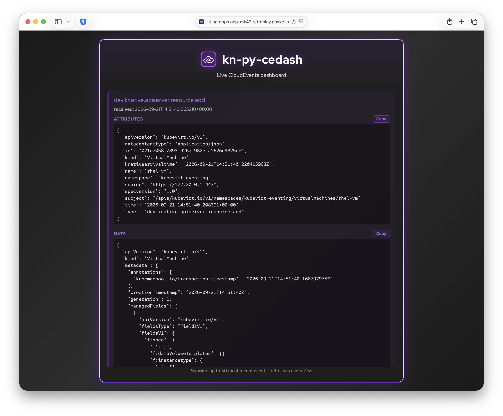

# kn-py-cedash

Example Python function with a `Flask` REST API running in Knative. It
decodes and logs incoming [CloudEvents](https://github.com/cloudevents/sdk-python)
(same behavior as `kn-py-echo`), and additionally serves a live dashboard at
`GET /` showing the most recently received CloudEvents (PatternFly 6 UI,
purple theme), refreshing automatically as new events arrive.



## Step 1 - Build with `Buildpacks`

[Buildpacks](https://buildpacks.io) are used to create the container image.

```shell
IMAGE=<podman-username>/<repo>/kn-py-cedash:1.0
pack build -B gcr.io/buildpacks/builder:v1 ${IMAGE}
```

## Step 1 (alternative) - Build with Podman

Instead of Buildpacks, you can build the container image directly from the
included `Containerfile` using [Podman](https://podman.io):

```shell
IMAGE=<registry>/<repo>/kn-py-cedash:1.0
podman build -t ${IMAGE} -f Containerfile .
```

## Step 1 (alternative) - Build a multi-arch image with Podman

If the image needs to run on nodes with different CPU architectures (e.g.
`amd64` and `arm64` in the same cluster), build a multi-arch manifest list
instead of a single-platform image. On macOS, `podman machine` ships with
the QEMU emulation needed to build for architectures other than the host's,
so this works out of the box — no extra setup required.

```shell
IMAGE=<registry>/<repo>/kn-py-cedash:1.0
podman manifest create ${IMAGE}
podman build --platform=linux/amd64,linux/arm64 --manifest ${IMAGE} -f Containerfile .
```

Push the whole manifest list (both architectures) to the registry:

```shell
podman manifest push --all ${IMAGE} docker://${IMAGE}
```

Verify the pushed manifest references both architectures:

```shell
podman manifest inspect ${IMAGE}
```

## Step 2 - Test

Verify the container image works by executing it locally.

```bash
podman run -e PORT=8080 -it --rm -p 8080:8080 ${IMAGE}
```

Open `http://localhost:8080/` in a browser to see the dashboard — it starts
empty ("Waiting for CloudEvents...") until an event is posted.

In a separate terminal window, use the `testevent.json` file to validate the
function is working.

```shell
curl -i -d@test/testevent.json localhost:8080
```

You should see a `200 OK` response with the pretty-printed decoded
CloudEvent as the JSON body, and the browser dashboard should update with
the new event within ~3 seconds without a manual reload.

## Step 3 - Deploy

> **Note:** The following steps assume a working Knative environment. The Knative `service` and `trigger` will be
installed in the Kubernetes namespace of your choice, assuming that the
`broker` is also available there.

Push your container image to an accessible registry once you're done
developing and testing your function logic.

```shell
podman push <username>/<repo>/kn-py-cedash:1.0
```

> If you built a multi-arch manifest list instead (Step 1 alternative
> above), push it with `podman manifest push --all` as shown there, rather
> than `podman push`.

```yaml
oc create -f - <<EOF
apiVersion: serving.knative.dev/v1
kind: Service
metadata:
  name: kn-py-cedash-fn
spec:
  template:
    metadata:
      annotations:
        autoscaling.knative.dev/maxScale: "1"
        autoscaling.knative.dev/minScale: "1"
    spec:
      containers:
        - image: quay.io/rguske/kn-py-cedash:1.0
---
apiVersion: eventing.knative.dev/v1
kind: Trigger
metadata:
  labels:
    eventing.knative.dev/broker: broker-apiserversource
  name: trigger-py-cedash-fn
spec:
  broker: broker-apiserversource
  filter:
    attributes: {}
  subscriber:
    ref:
      apiVersion: serving.knative.dev/v1
      kind: Service
      name: kn-py-cedash-fn
EOF
```

For testing purposes, the `function.yaml` contains the following
annotations, which will ensure the Knative Service Pod will always run
**exactly** one instance for debugging purposes (otherwise Knative may scale
to zero, which resets the in-memory event buffer on the next cold start):

```yaml
annotations:
  autoscaling.knative.dev/maxScale: "1"
  autoscaling.knative.dev/minScale: "1"
```

## Step 4 - Undeploy

```shell
oc delete -f function.yaml
```
